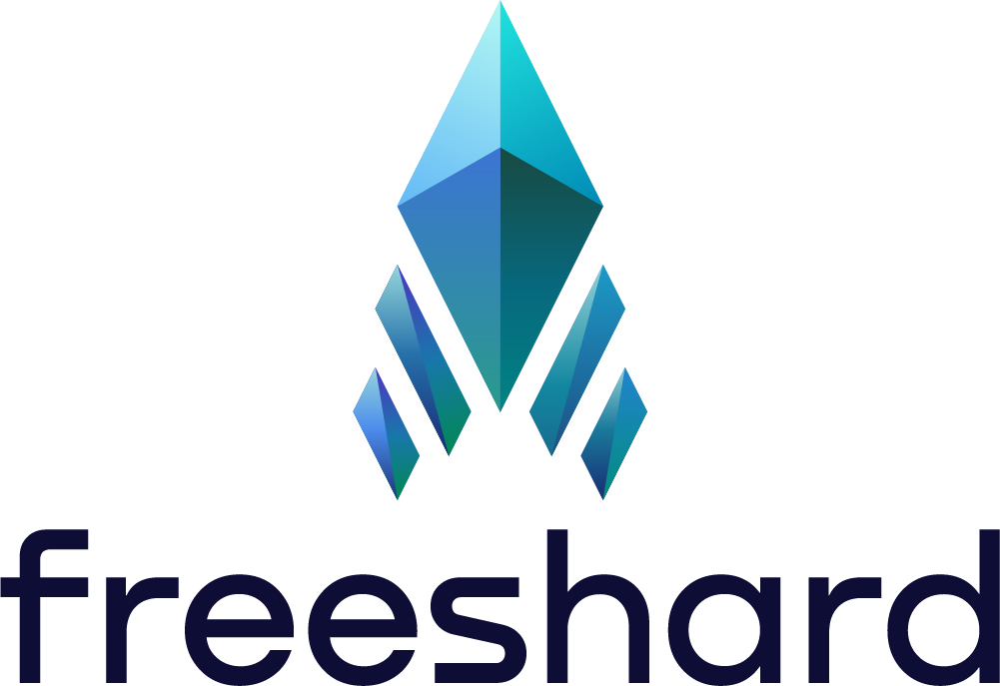

<p align="center">
<picture>
    <source media="(prefers-color-scheme: dark)" srcset="readme/Freeshard_logo_for_dark.png">
    <source media="(prefers-color-scheme: light)" srcset="readme/Freeshard_logo_for_light.png">
    
</picture>
</p>

> [!NOTE]
> Freeshard used to be called _Portal_. Don't be confused if you see the old name in the code or documentation.
> Our goal is to update everything as soon as possible.

# Shard Core

This is the core application of the Freeshard project. A machine running it (virtual or physical) is called a Shard.

The overall documentation of the project (under its old name _Portal_) can be found at [docs.getportal.org](https://docs.getportal.org/).

## Overview

The following are the most important concepts and tasks that are performed by the Shard Core.

### Shard ID

Each Shard has a unique ID that is generated during the first start.
This ID is exposed to the user and is expected to be used similar to a phone number.
The understanding should be that a Shard ID corresponds to a person - the owner of the Shard.
For hosted Shards, the ID is also part of the domain name.

The Shard ID is a hash of the Shard's public key.
Therefore, it can be used to authenticate the Shard during communication or to verify data signed by the Shard.

Its full length is 96 characters, but it is usually shortened to 6 characters for easier handling.
This is seen as a compromise between security and usability.

### REST API

Shard Core provides a REST API separated into four parts which are accessible at different paths:

* `/public` - Public API, available without authentication
* `/protected` - Protected API, can only be called from paired terminals
* `/management` - Management API, can only be called from the management backend and is only relevant for hosted shards
* `/internal` - Internal API, only accessible from the same machine e.g. by apps or the reverse proxy

[API-doc](https://ptl.gitlab.io/portal_core/) of the latest stable release.

### App Management

Shard Core manages installing, uninstalling, updating, and running apps.
For each app, it creates a docker compose file from a template during installation and reconfigures the reverse proxy to route traffic to the app.
When the app is accessed, it uses docker to start the app's container(s).
After some time of inactivity, the app is stopped to save resources.

### Terminal Pairing and Management

Terminals are devices that have been paired with the Shard.
Shard Core offers a public endpoint where a new terminal can get paired, provided it has a valid pairing code.
That one-time code must be acquired from a protected endpoint by a previously paired terminal.
During pairing a JWT for subsequent authentication is issued and stored as a cookie in the terminal.

### Peer Management and Peer-to-Peer Communication

> [!NOTE]
> Since apps need to explicitly support peer-to-peer communication and no app currently does, this feature is currently disabled.

Shard Core allows the user to add other Shards as peers.
Apps can then use the internal section of the API to list and communicate with peers.
All communication is encrypted and authenticated using the shard IDs as trust anchors.

## Hosting

> [!WARNING]
> We are currently working on making self-hosting possible and easy.
> Expect some rough edges until then.

The Shard Core can be hosted on any machine that has access to the internet.
It is recommended to use a machine that is always on, e.g. a virtual private server (VPS).

You should be able to start the Shard Core on localhost with the following steps:

1. Get the `docker-compose.yml`.
2. Modify the `docker-compose.yml` by providing your information where it says `todo`. (Leave the DNS zone as it is for now.)
3. Start the Shard Core with `docker-compose up`.
4. Open `localhost:8080` in your browser and continue past the security warning; you are redirected to the public view of the Shard.
5. Make note of the Shard ID in the bottom left corner. Then, open `<shard_id>.localhost:8080` in your browser. This is needed so the authentication cookie actually works.
6. Run this command to get a pairing code: `docker run --rm -it --network portal curlimages/curl "http://shard_core/protected/terminals/pairing-code"`
7. Click on `Pair` and enter the pairing code.

### Let's Encrypt

Shard Core uses Traefik as a reverse proxy.
This is a fixed part of the setup and cannot be changed.

Traefik is configured to automatically request and renew SSL certificates from Let's Encrypt.
However, since the apps that are run by Shard Core are routed to subdomains of the Shard's domain, the certificate needs to be a wildcard certificate.
That means that a [DNS challenge must be used](https://doc.traefik.io/traefik/https/acme/#wildcard-domains) to prove ownership of the domain.
And that requires some manual configuration.

In the `docker-compose.yml`, you need to add some environment variables to the Traefik service depending on your DNS provider. [Here is a list of providers](https://doc.traefik.io/traefik/https/acme/#providers) and the required variables.

## Development

Make sure to set up your Python environment and install dependencies using the tools of your choice.

Then, export the environment variable `CONFIG=config.yml,local_config.yml` so the `local_config.yml` is loaded in addition to the default `config.yml`.
You can modify the `local_config.yml` to your needs, e.g. to set different log levels.

Run development server with 
```shell
fastapi dev --port 8080 shard_core/app.py
```

Or - if you use [Just](https://just.systems/) - run `just run-dev`.

Then, access API-doc at [http://localhost:8080/docs](http://localhost:8080/docs)

If you also want to run the web UI locally, pull it from [here](https://github.com/FreeshardBase/web-terminal) and follow the instructions in its README.

> [!NOTE]
> When developing, you will typically run backend and frontend locally and without a reverse proxy. This means that you will not be able to start apps, since they rely on being accessed through the reverse proxy.
